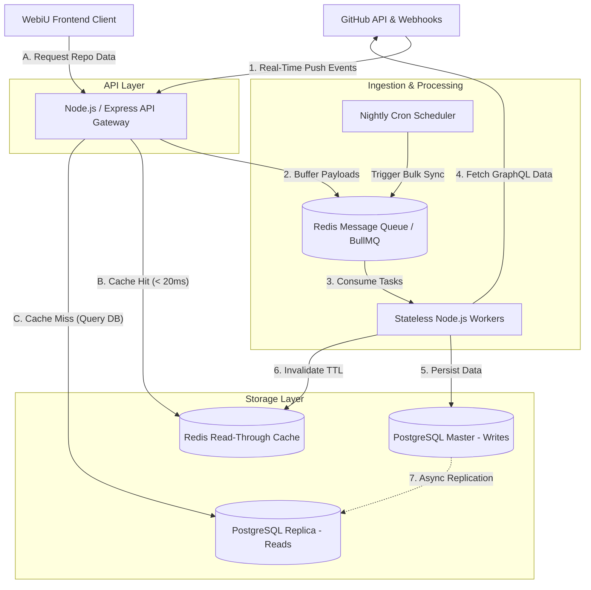

# System Design: Scalable GitHub Data Aggregation System

**Project:** WebiU Pre-GSoC 2026 Task 1  
**Candidate:** Pratham  
**Objective:** Design a highly available, event-driven architecture to aggregate data from 300+ (scaling to 10,000+) GitHub repositories, minimizing API rate limits while ensuring real-time UI updates, robust security, and deep observability.

---

## 1. Architecture Overview

The system follows a decoupled, microservices-oriented architecture to separate real-time data ingestion from API serving. This ensures the frontend remains highly responsive even during massive background data syncs.

### System Flowchart

---

## 2. Core Components & Technology Stack

| Component | Technology | Justification |
| :--- | :--- | :--- |
| **API Gateway** | Node.js / Express | Highly efficient for I/O-bound tasks. Handles incoming webhooks and serves JSON to the frontend. |
| **Message Broker** | Redis + BullMQ | Decouples ingestion from processing. Buffering incoming payloads prevents the server from crashing under high load. |
| **Processing Workers**| Node.js | Stateless background services that consume the queue, execute API requests, and format payloads. |
| **Database** | PostgreSQL | Relational data model ensures ACID compliance and supports complex sorting/filtering for repository metadata. |
| **Caching Layer** | Redis | Sits in front of the database to serve high-frequency read requests with sub-10ms latency. |
| **Observability** | Prometheus / Grafana | Monitors system health, specifically tracking Redis queue depth and GitHub API rate-limit headers. |

---

## 3. Update Mechanism & Security

To maintain synchronization without constantly polling the GitHub API, the system uses a **Dual-Ingestion Strategy**:

* **Primary (Push-Based via Webhooks):** GitHub Webhooks are configured on target repositories. When a relevant event occurs (e.g., `push`, `issues`, `repository.deleted`), GitHub sends an HTTP POST payload. 
    * *Security Verification:* The API Gateway strictly verifies the `X-Hub-Signature-256` HMAC hex digest to ensure the payload is authentically from GitHub before processing it.
    * *Action:* The worker node updates (or soft-deletes) the database row and invalidates the Redis cache for that specific repo.
* **Reconciliation (Pull-Based):** A scheduled Cron job runs nightly to catch any missed webhook events and sync historical metrics that do not trigger webhooks.

---

## 4. Rate Limit Handling & Data Fetching

> **Engineering Goal:** Stay strictly within GitHub's 5,000 requests/hour authenticated limit, even when syncing 10,000+ repositories.

1.  **Webhook Reliance:** Webhook payloads provide real-time data and consume **zero** API rate limits.
2.  **GraphQL over REST (with Pagination):** For bulk fetches during the reconciliation sync, workers use the GitHub GraphQL API. Instead of making multiple REST calls, GraphQL fetches all nested data in a single request. Workers utilize **Cursor-based pagination** to efficiently traverse massive datasets without hitting query timeouts.
3.  **Conditional Requests:** The cron job utilizes `If-Modified-Since` and `ETag` headers. If the repository hasn't changed since the last sync, GitHub returns a `304 Not Modified` status, which bypasses rate limit deductions.

---

## 5. Data Storage Strategy

* **Stored Persistently (PostgreSQL):** Core metadata needed for UI sorting/filtering is stored in the database. Examples: `repo_id`, `name`, `description`, `stars`, `forks`, `open_issues`, `last_updated_at`.
* **Fetched Dynamically (Client-Side):** Highly volatile or massive data chunks (e.g., the raw Markdown content of a `README.md` or real-time commit diffs) are fetched dynamically by the frontend client directly from the GitHub CDN (`raw.githubusercontent.com`). This offloads server bandwidth and storage.

---

## 6. API Flow & Performance Optimization

**Frontend Interaction Flow:**
1.  The WebiU frontend sends a `GET /api/v1/repositories?sort=stars` request.
2.  The API Gateway intercepts the request and checks the Redis cache.
3.  **Cache Hit:** Redis returns the serialized JSON instantly (`< 20ms`).
4.  **Cache Miss:** The API queries the PostgreSQL Read Replica, serializes the response, stores it in Redis with a 5-minute Time-To-Live (TTL), and returns the data to the frontend.

**Optimization:** B-Tree indexes are applied in PostgreSQL on frequently queried columns (`stars`, `last_updated`) to optimize DB-level sorting and ensure fast response times even on cache misses.

---

## 7. Scalability Plan (300 to 10,000 Repositories)

Scaling the system by 30x primarily stresses the ingestion and database layers:

* **Horizontal Scaling (Compute):** Because the worker nodes are completely stateless, an orchestrator (like Kubernetes or AWS ECS) can automatically scale the number of worker instances based on the depth of the Redis queue during high-traffic periods (e.g., Hacktoberfest).
* **Database Scaling (Storage):** To prevent read/write locks, PostgreSQL is scaled via **Read Replicas**. Worker nodes write exclusively to the Master database, while the API Gateway serves frontend requests exclusively from the Read Replicas.

---

## 8. Failure Handling & Resilience

* **Rate-Limit Exhaustion:** Workers actively monitor the `X-RateLimit-Remaining` header. If it drops to zero, workers implement an **Exponential Backoff** strategy, pausing queue consumption until the `X-RateLimit-Reset` timestamp.
* **Network Timeouts / API Failures:** Failed jobs in the Redis queue are automatically retried up to 3 times before being moved to a Dead Letter Queue (DLQ) for manual inspection.
* **Database Downtime:** If PostgreSQL goes down, the API layer implements a **Circuit Breaker Pattern**, temporarily serving stale data directly from the Redis cache to ensure the frontend UI remains functional for users.
